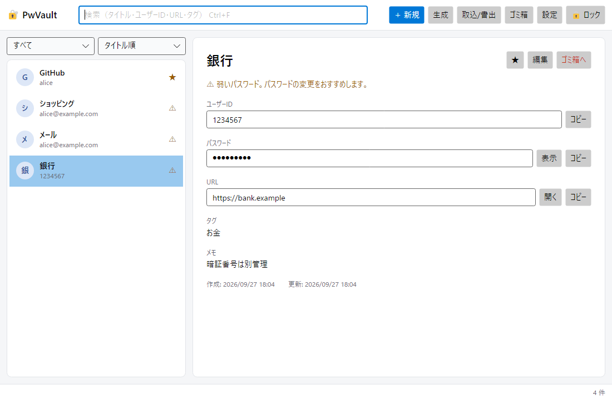

# PwVault

ローカル完結のパスワード管理デスクトップアプリ（Windows / macOS）。
保管庫は暗号化した 1 つのファイルとして PC 上に置きます。通信するのは、設定でオンにしている「サイトのアイコン取得」と「更新の確認」だけで、どちらもオフにできます。



## ダウンロード

[Releases](../../releases) から、使っている OS 用のファイルをダウンロードします。

| OS | ファイル |
| --- | --- |
| Windows 10 / 11 | `PwVault-<版>-win-x64.exe`（インストール不要。ダブルクリックで起動） |
| macOS 12 以降（Apple Silicon） | `PwVault-<版>-osx-arm64.zip` |
| macOS 12 以降（Intel） | `PwVault-<版>-osx-x64.zip` |

`.sha256` はファイルが壊れていないかの確認用、`.sig` はアプリの自動更新が使う電子署名です。

### Windows で初めて起動するとき

署名していない exe なので「Windows によって PC が保護されました」と出ることがあります。「詳細情報」→「実行」を選んでください。

### macOS で初めて起動するとき

Apple の開発者登録・公証をしていないため、そのままでは「開発元を確認できないため開けません」と表示されます。

1. zip を展開し、`PwVault.app` を「アプリケーション」フォルダに移す
2. `PwVault.app` をダブルクリックし、警告が出たら閉じる
3. 「システム設定」→「プライバシーとセキュリティ」を開き、下の方の「"PwVault" は開発元を確認できないため…」の横の **このまま開く** を押す

（ターミナルを使う場合は `xattr -dr com.apple.quarantine /Applications/PwVault.app` でも開けるようになります。）

## 主な機能

| 機能 | 要件 |
| --- | --- |
| 保管庫の作成・アンロック・手動／自動ロック（無操作・OS ロック・スリープ） | FR-01〜03 |
| エントリの追加・編集・ゴミ箱・完全削除、タグ、お気に入り、並び替え | FR-04, 05, 16 |
| 入力と同時に絞り込む検索（タイトル・ユーザーID・URL・タグ） | FR-06 |
| パスワード生成（8〜128 文字、文字種、紛らわしい文字の除外） | FR-07 |
| クリップボードへのコピーと自動クリア（クリップボード履歴から除外） | FR-08, SR-10 |
| パスワードの伏せ字表示と切り替え | FR-09 |
| マスターパスワード・KDF パラメータの変更（保管庫鍵の再ラップのみ） | FR-10, 13 |
| 暗号化バックアップ、平文 CSV（警告＋再認証） | FR-11, SR-12 |
| CSV インポート（Chrome / Edge / Firefox、Bitwarden、KeePassXC） | FR-12 |
| 弱いパスワード・使い回しの検出、パスワード変更履歴 | FR-14, 15 |
| ブラウザの入力欄を右クリック →「PwVault」からエントリを選んで ID・パスワードを入力（Chrome / Edge / Firefox） | 追加 |
| 一覧にサイトのアイコンを表示（ブラウザ拡張から受け取る＋各サイトから直接取得。直接取得は設定でオフ可） | 追加 |
| 一覧のダブルクリックでサイトを開く（設定でオン／オフ） | 追加 |
| ×ボタンで通知領域（Mac はメニューバー）に隠す（設定でオン／オフ） | 追加 |
| Windows Hello（顔認証・指紋・PIN）でのアンロック（Windows のみ） | 追加 |
| 更新の通知と、署名を確かめたうえでの自動更新（Windows。Mac は通知とダウンロードページ） | 追加 |
| PC にサインインしたら自動で起動（通知領域に隠れた状態で。設定でオン／オフ） | 追加 |
| ロック中にブラウザの右クリックメニューから「PwVault をアンロックする」（アンロック画面を前に出す／起動する） | 追加 |
| 保存先の切り替え（この PC / Google ドライブ / Nextcloud / その他の同期フォルダ）と、複数の PC での同じ保管庫の利用 | 追加 |
| テーマの切り替え（一覧の右下のボタンでライト ⇄ ダーク。設定で「OS に合わせる / ライト / ダーク」と色を 9 種類から選択） | 追加 |
| タイトルバーとツールバーを一体化した画面（上部の何もない所をドラッグしてウィンドウを移動） | 追加 |
| 使い方のチュートリアル（初回画面・保管庫の作成直後・「設定 → 使い方」から） | 追加 |
| 設定のカテゴリー分け（一般・表示・セキュリティ・保存先と同期・ブラウザ連携・更新・使い方） | 追加 |

## ほかの PC と保管庫を共有する（Google ドライブ・Nextcloud）

「Google ドライブ パソコン版」や「Nextcloud デスクトップ」が PC 上に作る同期フォルダに保管庫を置くと、ほかの PC でも同じ保管庫を使えます。アップロード・ダウンロードはそれらのアプリが行い、PwVault 自体はクラウドと通信しません（クラウドに置かれるのは暗号化済みのファイルだけです）。

1. 1 台目の PC: 「設定」→「保存先」で **Google ドライブに移す** / **Nextcloud に移す** を押す（`同期フォルダ/PwVault/vault.pwv` に移ります）。OneDrive・Dropbox などは **その他の場所へ…** で同期フォルダを選びます
2. 2 台目の PC: 同期アプリを入れて同期が終わったら PwVault を起動し、最初の画面の **Google ドライブの保管庫を開く**（Nextcloud なら **Nextcloud の保管庫を開く**）を押して、同じマスターパスワードでアンロックする

- 複数の PC で同時に使っても大丈夫です。保存の直前と、アンロック中は数秒ごとに、ほかの PC の変更をエントリ単位で取り込みます
- 同じエントリを両方の PC で変えたときは、新しい方を残します。もう一方で入れたパスワードは「パスワードの履歴」に残るので失われません
- 同期アプリが作る競合コピー（`vault (conflicted copy …).pwv`、`vault (1).pwv` など）も自動で取り込み、取り込んだら消します
- ある PC でマスターパスワードを変えると、開いているほかの PC は自動でロックされ、「ほかの端末でマスターパスワードが変更されました」と出ます。新しいマスターパスワードでアンロックしてください（その間の未保存の変更は退避して自動で取り込みます。Windows Hello は各 PC で登録し直してください）。心当たりがないのにこの表示が出たら、保管庫ファイルが書き換えられた可能性があるので、アンロックせずにバックアップ（.bak）から戻すことを検討してください
- 「この PC に移す」で戻したときは、ほかの PC が使っているかもしれないので、クラウド側のファイルは残します
- PC の起動直後で同期フォルダの準備ができていないときは、ロック画面で「保管庫ファイルが見つかりません」と出て、見つかりしだいアンロックできるようになります
- 想定外のエラーが起きたときは、アプリを落とさずに変更を保存（できなければ退避）してロックします（原因の調査用に、エラーの種類だけを `%LOCALAPPDATA%\PwVault\Logs\errors.log` に記録します）
- 保存できないままロックしたときは、変更を「vault (保存できなかった変更 日時).pwv」に暗号化したまま退避し、ロック画面で場所を案内します（同じ保管庫なら次のアンロックで自動で取り込みます）

## Windows Hello でのアンロック（Windows）

「設定」→「Windows Hello でアンロック」でマスターパスワードを入力して **有効にする** を押し、Windows Hello の確認をします。次回から、ロック画面の「Windows Hello でアンロック」（ウィンドウが前面なら自動で表示）で開けます。

- 鍵は Windows が守る取り出せない場所（TPM など）にあり、登録はその PC にだけ保存されます
- 忘れないよう、既定では 14 日ごとにマスターパスワードでのアンロックが必要です（設定で変更可）
- マスターパスワードを変えると登録は解除されます

## 更新

起動の少し後と 1 日 1 回、新しい版を確認し、あれば画面上部に通知します（「設定」→「更新」でオフにできます）。

- **Windows**: 「更新して再起動」で、ダウンロード → 電子署名の確認 → 入れ替え → 再起動まで自動で行います。署名はアプリに埋め込んだ公開鍵で確かめ、版・ファイル名・中身が一致しないものは使いません
- **macOS**: 「更新して再起動」でリリースページを開くので、新しい zip をダウンロードして入れ替えてください

## ブラウザ連携（右クリックで自動入力）

1. PwVault の「設定」→「ブラウザ連携」で **有効にする** を押す（ブラウザへの登録と拡張機能の展開を行います）
2. 拡張機能を読み込む（設定画面の「フォルダを開く」で場所が分かります）
   - **Chrome / Edge**: `chrome://extensions`（`edge://extensions`）→「デベロッパー モード」をオン →「パッケージ化されていない拡張機能を読み込む」→ `chromium` フォルダ
   - **Firefox**: `about:debugging#/runtime/this-firefox` →「一時的なアドオンを読み込む」→ `firefox` フォルダの `manifest.json`（署名なしのため Firefox を再起動すると外れます）
3. PwVault をアンロックした状態で、ログイン画面の ID 欄かパスワード欄を右クリック →「PwVault」→ エントリを選ぶ

- 候補は、表示中のページの URL と保存した URL を照合して出します（`example.com` で保存 → `login.example.com` でも出る。似せたドメインや、https で保存したものを http のページでは出さない）
- PwVault がロック中・起動していないときは、メニューの「🔒 PwVault をアンロックする…」を選ぶと、PwVault のアンロック画面が前に出ます（起動していなければ起動します。Windows Hello を有効にしていれば確認画面もすぐ出ます）。アンロックすると候補が自動で並びます。マスターパスワードはブラウザではなく PwVault に入力します
- 候補が古いときは、メニューの「候補を更新」を選んでください
- アプリを別の場所に移したら、PwVault を 1 度起動すれば登録先が自動で更新されます
- PwVault を更新すると、拡張機能も自動で新しい版に読み込み直されます（v0.5.1 以降。v0.5.0 以前から更新したときだけ、1 度 `chrome://extensions` などで拡張機能の ↻（再読み込み）を押してください）

## キーボードショートカット

Mac では Ctrl の代わりに ⌘ を使います。

| Windows | Mac | 操作 |
| --- | --- | --- |
| Ctrl+F | ⌘F | 検索欄へ |
| Ctrl+N | ⌘N | 新規エントリ |
| Ctrl+E | ⌘E | 編集 |
| Ctrl+S / Esc | ⌘S / Esc | 編集の保存 / キャンセル |
| Ctrl+B | ⌘B | ユーザーIDをコピー |
| Ctrl+Shift+C | ⇧⌘C | パスワードをコピー |
| Ctrl+G | ⌘G | パスワード生成 |
| Ctrl+L | ⌘L | ロック |

## 構成

```
src/PwVault.Core     暗号コア（UI 非依存）: 鍵階層・AEAD・ファイル形式・保存・生成・検索・CSV・クイックアンロック・更新の署名
src/PwVault.App      Avalonia UI（MVVM）: 画面・自動ロック・クリップボード・設定・ブラウザ連携・Windows Hello・更新
browser-extension/   ブラウザ拡張（Chrome/Edge/Firefox 共通。アプリに埋め込まれ、有効化時に展開される）
tests/               ユニットテスト・テストベクタ・改ざん検知・ヘッドレス UI テスト
tools/               リリース用（署名、macOS のアプリ作成）
```

- 言語・UI: C# / .NET 10 / Avalonia 12
- 暗号: [NSec](https://nsec.rocks/)（libsodium）… Argon2id、HKDF-SHA256、XChaCha20-Poly1305、Ed25519（更新の署名）

## ビルドと実行

.NET 10 SDK が必要です。

```bash
dotnet run --project src/PwVault.App
```

テスト:

```bash
dotnet test
```

実際のクリップボードを使うテスト（クリップボードの中身を書き換えるので通常は実行しない）:

```bash
dotnet test tests/PwVault.App.Tests --explicit only
```

## リリースの出し方

`src/PwVault.App/PwVault.App.csproj` の `<Version>` を上げてタグを push します。GitHub Actions が Windows と macOS でテスト・ビルド・署名して、リリースに添付します。

```bash
git tag v0.4.0
git push origin v0.4.0
```

署名用の秘密鍵は GitHub の Secrets（`RELEASE_SIGNING_KEY`）にだけあります。失くした場合は新しい鍵を作ってアプリの公開鍵（`ReleaseSignature.PublicKeyBase64`）を差し替えます（その版までは手動で更新が必要）。

## ライセンス

Copyright (C) 2026 FalledCan

[GNU General Public License v3.0](LICENSE)。改変して配布する場合は、同じライセンスでソースコードを公開してください。

利用しているライブラリ（NSec / libsodium、Avalonia、CommunityToolkit.Mvvm、SkiaSharp など）はいずれも MIT・ISC 等の GPL-3.0 と両立するライセンスです。

## ファイル

| 場所 | 内容 |
| --- | --- |
| `ドキュメント/PwVault/vault.pwv`（既定。作成時・設定の「保存先」で変更可。同期フォルダなら `同期フォルダ/PwVault/vault.pwv`） | 保管庫 |
| 同じフォルダの `vault.pwv.bak1`〜 | 保存のたびに残す直前の版（世代数は設定で変更） |
| 同じフォルダの `vault.pwv.icons` | サイトのアイコンのキャッシュ（保管庫の鍵で暗号化。消しても取り直すだけ） |
| Windows: `%APPDATA%\PwVault\settings.json` | 機密を含まない設定（保管庫の場所、自動ロック時間など） |
| Windows: `%LOCALAPPDATA%\PwVault\QuickUnlock\` | Windows Hello の登録（この PC だけ） |
